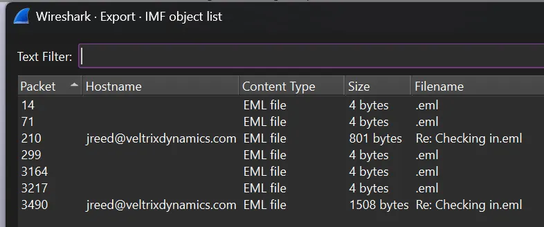
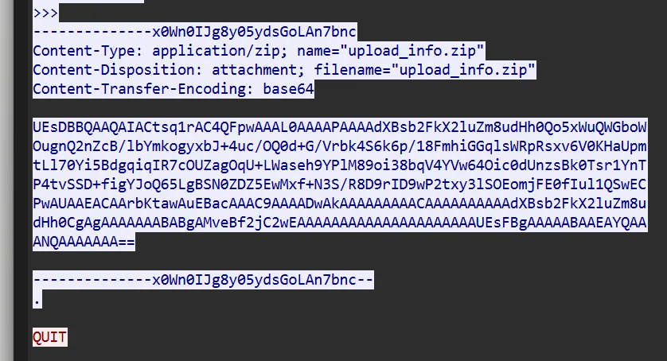
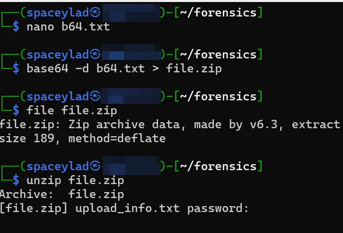
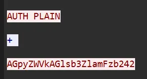
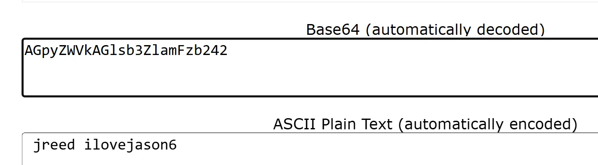
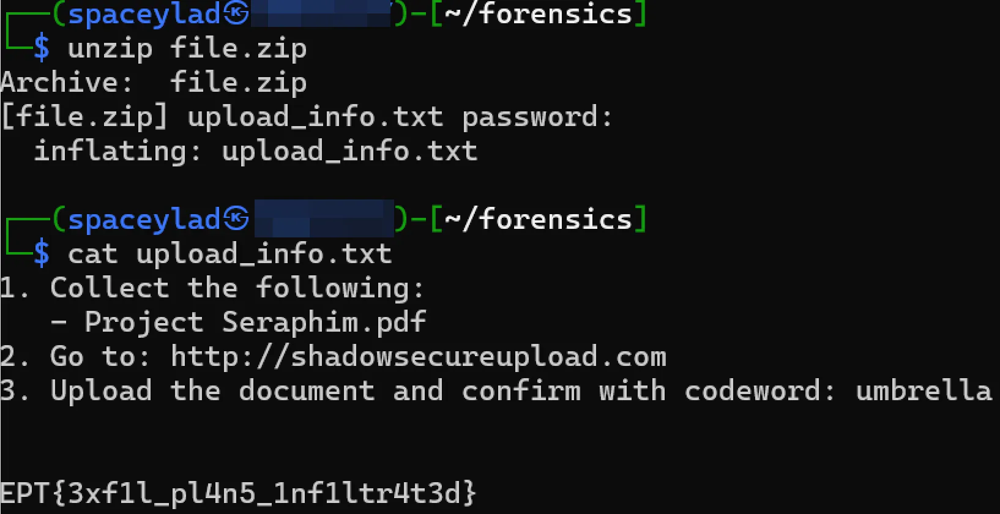

# Writeup: Insider threat
## Team: big🔥
**Author:** SpaceyLad (Stian Kvålshagen)

This is a forensics type of task. You are given a .pcap with some mails and conversations that goes back and forth between two actors.

To solve this task, you need 2 things (Something you are not told, but you have to figure out yourself).

- There is a zip file somewhere hidden in the network logs. This zip file
- A message hints that the password to open this message is the “regular account password”.

To find the zip file, we have to explore the logs a bit. I found the base64 encoded version of the file, so I decoded it directly into a file. When trying to unzip it, it indicates that we need the password.

The regular account password.. This is where I was stuck for a little while. Because I found this Auth with a value..

But when I tried to use it, nothing happned.. So I dug deeper into the logs to find the “real” password.. Only to 20 min later realize that I should have checked how the auth protocol works.. Because if you decode it, you will get the username and password.. Kind of like basic auth..

Using that password.. Bam! The zip is opened and the flag can be read!

